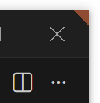
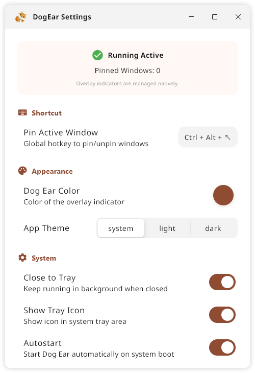
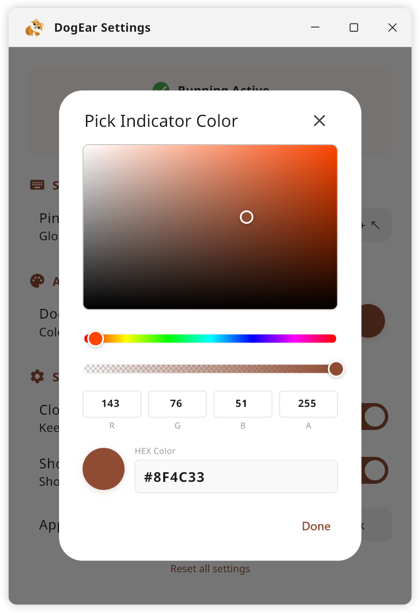

# 🐶 DogEar

[](https://flutter.dev)
[](https://opensource.org/licenses/MIT)

**DogEar reimagines** how you manage a cluttered workspace by bringing the physical intuition of "book-folding" to the Windows desktop. It transforms your multi-window workflow by allowing you to fold a corner of any application—creating a visual **"DogEar" bookmark** that stays pinned to your target window, ensuring you never lose track of your active tasks again.

<div align="center">
    
    <p><i>Example: A "DogEar" pinned to VS Code for instant identification.</i></p>
</div>

**Why DogEar?** In a sea of dozens of open windows, traditional taskbars and tab-switchers often fall short. DogEar provides a **persistent visual anchor** for your most important work. Whether you are tracking a critical document, locking a reference image, or managing complex multitasking, DogEar ensures your prioritized windows are instantly identifiable and always accessible.

<div align="center">
    
    <p><i>The elegant DogEar interface featuring the signature Warm Brown theme.</i></p>
</div>

---

## ✨ Key Features

* **📐 Intuitive Tagging**
    * Instantly "dog-ear" any active window with a customizable keyboard shortcut.
* **🎨 Zero-Interference Overlay**
    * Achieves pixel-perfect transparency and custom polygonal shapes (triangles) that stay on top without stealing focus or blocking your content.
* **🚀 Native Integration**
    * Leverages high-performance Win32 hooks to ensure markers follow their target windows flawlessly across the screen.
    * Built with Flutter and dart:ffi for a seamless, native experience that respects your system resources.
* **✨ Aesthetic Personalization**
    * Customize DogEar colors to match your workspace preferences.
    <div align="center">
        
        <p><i>Tailor your experience: Customize DogEar colors to complement your creative environment.</i></p>
    </div>

**Note on Permissions:** To "dog-ear" windows running with Administrator privileges (e.g., Task Manager or elevated Command Prompts), **DogEar** itself must be launched with **Administrator privileges** due to Windows UIPI security constraints.

---

## 📥 Installation & Security

### 🛡️ Note on Windows SmartScreen
Because DogEar is an independent open-source project, the installer is **not digitally signed** with a commercial certificate (which costs hundreds of dollars annually). 

When you run the installer, Windows may display a blue **"Windows protected your PC"** warning. 
* **To proceed:** Click **"More info"** and then **"Run anyway"**.
* **Why this happens:** This is a standard security measure for apps that haven't yet established a global reputation with Microsoft. 
* **Trust:** You can verify the integrity of the app by checking the open-source code or building it from source yourself.

### 🔍 Verification
To ensure the installer hasn't been tampered with, we provide the **SHA-256 checksum** for every official architect in the [Releases](https://github.com/PythiaLaurus/DogEar/releases) page. 

You can verify the file integrity by running this command in PowerShell:
```powershell
Get-FileHash <path_to_installer> -Algorithm SHA256
```

---

## 🚀 Getting Started

### Prerequisites
* Windows 10/11
* Flutter SDK (Stable channel)
* Visual Studio 2019+ (with "Desktop development with C++" workload)

### Build & Run

1.  **Fetch dependencies**
    ```bash
    flutter pub get
    ```

2.  **Generate files**
    ```bash
    dart run build_runner build
    ```

3.  **Run in Debug mode**
    ```bash
    flutter run -d windows
    ```

4.  **Build Release version**
    ```bash
    flutter build windows
    ```
